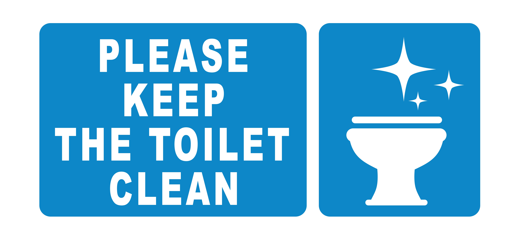
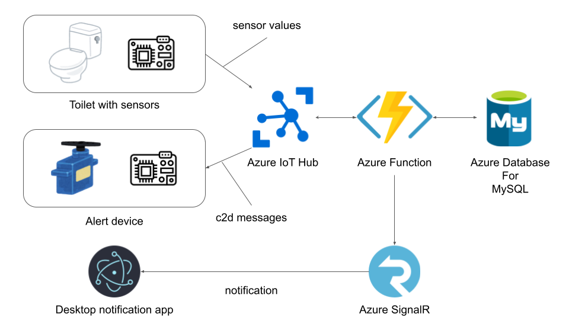
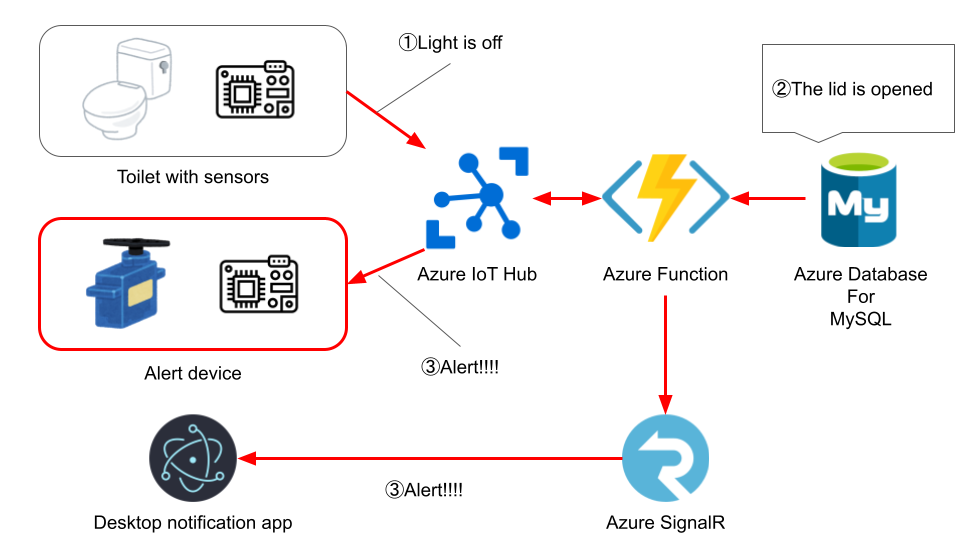
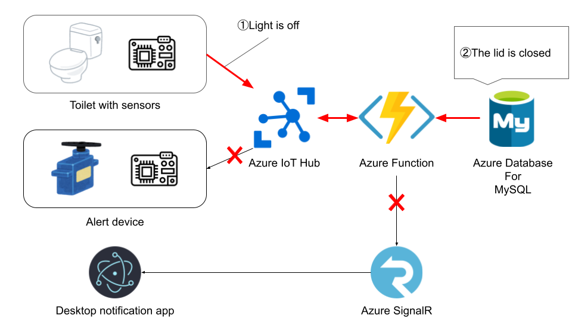
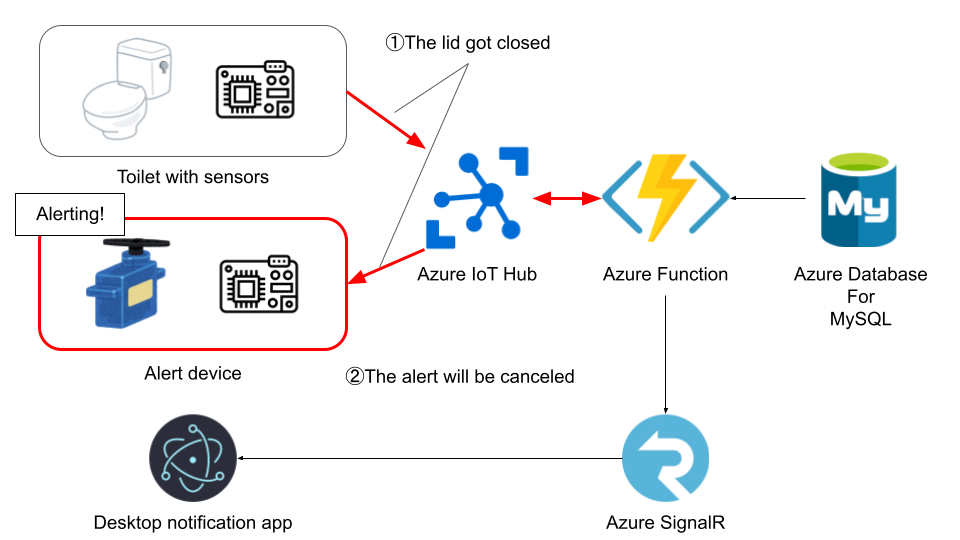
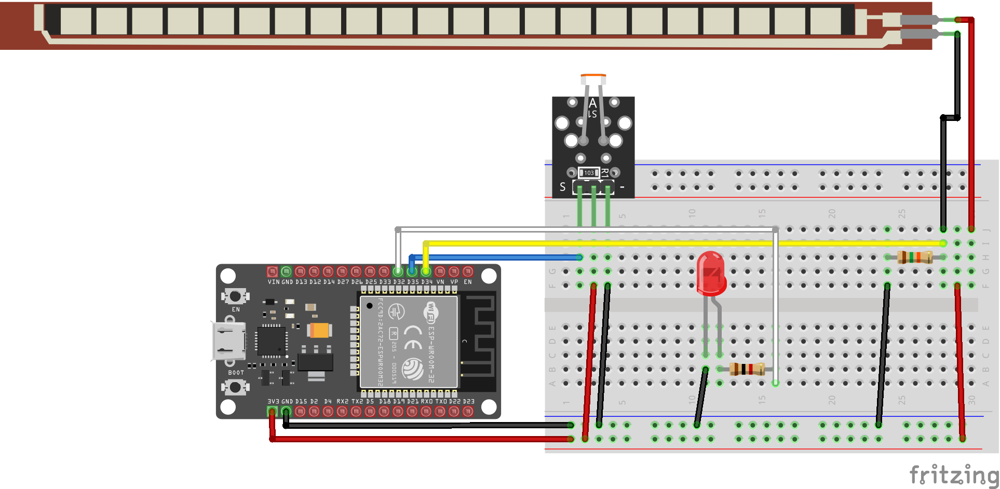

# Toilet Keeper


# Keep Your Toilet Clean and Keep Your Partner Happy

This is an alert system to keep your toilet clean and keep your partner happy.(If he/she doesn't like your way of using toilet.lol)
With this system, if you leave bathroom without closing the toilet lid , the unique alert system and a desktop notification let you know you forget to close the lid.

Check the demonstration on youtube.
https://youtu.be/lbmWat5kvqQ

See my dev.to post about his system.
https://dev.to/iron_samurai/azure-trial-hackathon-submission-post-placeholder-title-l7f-temp-slug-9976056?preview=b2e5c1e09dc8dcb0ef66921823741e964c579cfadde56dfdc467701521d9c98272dd82f39ab4366b288140d8768e624a51e3d09862a96f5880ad47bc

# Why I built this system
Have you ever been told to close the toilet lid?  
Yes,I have.  
Now I am living with my girlfriend ,and she often told me to close the toilet lid after I use bathroom.
She says closing it is good for keeping the toilet clean and having less chances to drop something into toilet.
I agreed with her but could not make a habit of closing the lid everytime I use bathroom. At that time, I happened to use Azure IoT Hub at work and find [this azure hackathon on DEV.to](https://dev.to/t/azuretrialhack).
I felt like I could build something to break my bad habit and decided to join the hackathon!  
I hope this system will help somebody who has the same habit and a partner who doesn't like it. lol  
Happy Hacking!

# System Overview


# How it works
## When the alert device receives messages
There are 2 timings when the alert device receives messages from the cloud.
1. When you leave bathroom without closing the toilet lid  
2. When you close the toilet lid

### 1. When you leave bathroom without closing the toilet lid
When you leave bathroom, the light sensor sends "off" to the function.  

If the latest flex sensor data shows "The lid is opened",the function tells Alert device and Desktop app to activate the alert system.



What if the latest flex sensor data shows "The lid is closed"?  
That is the ideal state and the function sends nothing.


### 2. When you close the toilet lid
The function always sends a message to the alert device but never to the desktop app since the desktop app is stateless and nothing needs to be changed when the lid gets closed.

If the alert device is already alerting, the alert will be canceled.  



If the alert device is not alerting, it does nothing.  


## When sensor values are sent 
Sensor values are sent when the state of each sensor changes.
- Flex sensor
    - not being bended → bended
    - bended → not being bended
- Light sensor
    - off　→ on
    - on → off

# What you need to build your own system
## Azure Resources
- Azure IoT Hub
- Azure Functions
  - A Function to persist telemetries from IoT Hub and send messages to devices 
  - A signalR negotiator function
- Azure Database for MySQL
- SignalR

## Devices
- ESP32 board(DOIT ESP32 DevkitV1) x2
- LDR module x1
- Flex(Bend) sensor x 1
- LED x 2
- 1kΩ resistance x 2 (for LED)
- 10kΩ resistance x 2 (for Flex Sensor)
- servo motor (I used sg90)
- battery x1 (For Motor) (If you don't have outlets in your bathroom, you need 2)
- Rotating light(GOOLRC AX-511R)

# Others
- Your own toilet model.  
  (Don't worry,even if you cannot make this. You can still get notifications from Electron app in this repo.)  
I made the model with clay and stainless wires but using 3d printer would be much cooler and easier.
Even if you don't have 3d printer, anything you can make 3d things will do.


# How to start your application
1. Deploy azure resources  
   1. Deploy resources you need on azure portal.  
   2. Deploy function codes.  
   You can deploy function codes by running following code in each function code directory
   Don't forget to build before uploading.
      ```shell
        npm run build && func azure functionapp publish $YOUR_FUNCTION_APP_NAME
      ```
   3. Set environment variables for `iot-hub-triggered function` on application settings in azure portal.  
      List of environment variables
      - DB_USER_NAME
      - DB_HOST
      - DB_PASSWORD
   4. Set iot-hub connection strings as eventHubConnectionString for `iot-hub-triggered function` to bind Azure IoT Hub on application settings in azure portal.
   5. Set signalr connection strings as AzureSignalRConnectionString for `both functions` to bind SignalR on application settings in azure portal.

2. Assemble your IoT devices.  
   1. Wire parts referring the following pics.
   - Transmitter
   
   - Receiver
   

   2. Upload your arduino sketch to each board.
      Don't forget fill your iot-hub connection info in `iot_configs.h`
   3. Make your own toilet model (Most fun and hard part)
      In My case,
   4. Attach the flex sensor to your toilet.

3. Run the electron notification app on your local machine
   1. Fill your negotiator function url before starting the app.
   2. Start the app by running the following commands.
      ```shell
      cd DesktopAlert
      npm run start
      ```

4. Go to bathroom ,leave without closing the lid and turn off the light.
  The system will let you know the lid is open by the rotating light and the desktop notification.


